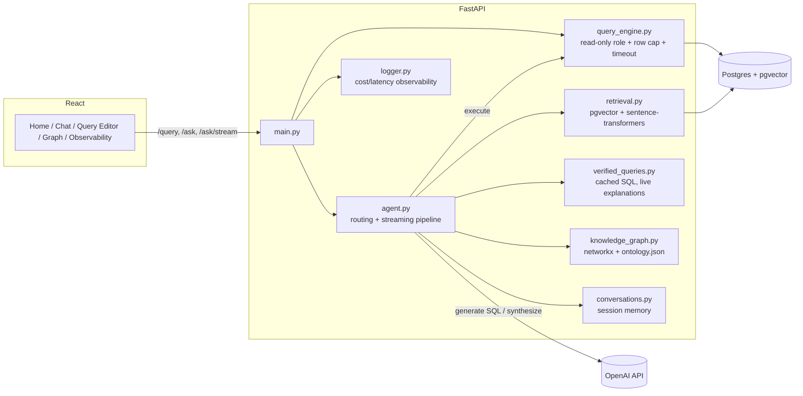

# DataLens

A GTM data assistant that answers plain-English questions with real SQL, retrieved account context, or both fused into one answer — not just a chatbot wrapper around a database. Read-only enforced at the database privilege level, evaluated by an independent LLM judge, and fully synthetic data (a fictional SaaS business, not modeled on or affiliated with any real company).


## What it does

Each question gets routed to one of four modes:

- **`sql`** — schema answers it directly (*"which accounts are at_risk?"*). Generates SQL, executes it, retries on error, streams a short explanation of the result.
- **`unstructured`** — only account notes or playbooks can answer it (*"how do I handle a pricing objection?"*). Retrieves the relevant chunks, synthesizes a cited reply.
- **`hybrid`** — needs a number *and* the story behind it (*"why is this account's consumption declining?"*). Runs the SQL, retrieves the notes, fuses them into one answer.
- **`chat`** — everything else, including an honest "I can't answer that" instead of a guessed number.

Every step is timed and shown in a reasoning trace under each answer. Home also surfaces a proactive panel on load — accounts trending under target before they're formally flagged at-risk — instead of waiting to be asked. There's also a raw SQL editor with the same safety guarantees, a knowledge graph viewer, and an observability dashboard with full cost/latency/trace detail per call.

## The parts worth reading the code for

**Read-only is enforced by Postgres, not app code.** A dedicated `datalens_readonly` role (`GRANT SELECT` only) replaced an earlier `.startswith("select")` check that missed both legit `WITH ... SELECT` CTEs and disguised writes like `WITH x AS (SELECT 1) DELETE FROM deals`. Verified with a live attack — ran that exact query through the role, confirmed the data was untouched. 35 tests cover this plus RAG/upload isolation, auth, and rate limiting.

**A knowledge graph bug once let raw SQL bypass retrieval entirely.** `networkx.add_edge()` silently creates a node for any table it hasn't seen — since `account_notes` and `document_chunks` both reference `accounts`, adding every live foreign key swept them into the schema the SQL-generator sees, and the agent wrote a query dumping note content straight into a result. Caught from a real test conversation, not a planned case. Fixed by only ever adding tables explicitly declared in `ontology.json`.

**Hybrid answers fuse structured and unstructured data, isolated by construction.** Account-scoped chunks always carry a real `account_id`; global content never does; retrieval filters in SQL (`account_id = %s OR account_id IS NULL`) — there's no code path where one account's note could leak into another's answer.

**The LLM judge had a false-negative bug.** It scored answers without the same glossary context the generating model had, and flagged a *correct* answer as wrong because it didn't know this project's own definition of "active deal." Fixed by giving the judge identical grounding — a judge with less context than the generator will always produce false negatives on context-dependent questions.

**Verified (cached) queries skip generation, never the explanation.** Cache matching is similarity-based (≥0.92), not exact text, so a canned explanation could easily not match what was actually asked. The SQL is safe to reuse verbatim; the explanation is generated live from the real question and real rows, every time.

**The agent used to hallucinate about itself.** Asked "how does RAG work here," it once explained a red/amber/green status indicator instead of retrieval-augmented generation — confidently wrong instead of asking which was meant. Fixed with a true, short self-description in the system prompt, plus a rule against picking one interpretation of an ambiguous term and running with it.

**Generated SQL uses `ILIKE`, not `=`, on name filters.** An exact match against a shortened name (`'Sinclair Care'` vs. stored `'Sinclair Care Partners'`) doesn't error — it silently returns `NULL`, which reads as a real answer. Wildcard matching costs nothing when the exact name is given, since it's a superset of an exact match, not a looser one.

## Architecture



Pipeline per `/ask` call: verified-match check → retrieve business context (RAG) → graph lookup (join paths) → generate SQL or a reply, streaming the writing step → execute, retrying on failure (up to 3x) → respond.

## Tech stack

| Layer | Choice | Why |
|---|---|---|
| Backend | FastAPI + Pydantic | Async, typed contracts, auto-generated docs |
| Data | Postgres + pgvector | Structured data and vector search under one privilege model |
| Vector search | pgvector + `all-MiniLM-L6-v2` | Local embeddings, no API cost; cosine search is a normal SQL `ORDER BY` |
| Knowledge graph | networkx | In-memory, derived from real foreign keys |
| LLM | OpenAI (`gpt-4o` generation, `gpt-4o-mini` judge) | Cheaper model for a narrower verification task |
| Streaming | Server-Sent Events | Only the free-text writing step streams — structured routing output can't stream meaningfully |
| Frontend | React + Vite + CodeMirror | Real SQL syntax highlighting, fast dev loop |
| Tests | pytest (35 tests) | The actual security and isolation boundaries, not incidental coverage |
| CI | GitHub Actions | pytest + frontend build on every push; eval suite on manual trigger |

## Running it locally

**Backend:**
```bash
cd backend
python3 -m venv venv && source venv/bin/activate
pip install -r requirements.txt
cp .env.example .env   # add your OPENAI_API_KEY and DATABASE_URL
python -m scripts.seed_db
python -m scripts.seed_unstructured
python -m scripts.embed_content
python -m scripts.seed_glossary
python -m scripts.seed_verified_queries
uvicorn app.main:app --reload
```

**Frontend:**
```bash
cd frontend
npm install
npm run dev
```

**Tests:**
```bash
cd backend
pip install -r requirements-dev.txt
pytest -v
```

**Eval suite** (costs a small amount of real OpenAI API usage):
```bash
cd backend
python -m scripts.run_eval
```

**Docker:**
```bash
docker compose up --build
```

## Limitations

- Conversation memory and rate limiting are in-memory, per-process — fine for a single instance, would move to Redis for multiple.
- Hybrid synthesis is single-account — "compare these 3 accounts" isn't supported yet.
- No request ID correlating trace steps across logs.
- No schema migrations — seed scripts truncate and recreate each run.

## Project history

Built incrementally with Claude Code as a pairing partner — see `PROJECT_PLAN.md` for how the plan evolved along the way.
