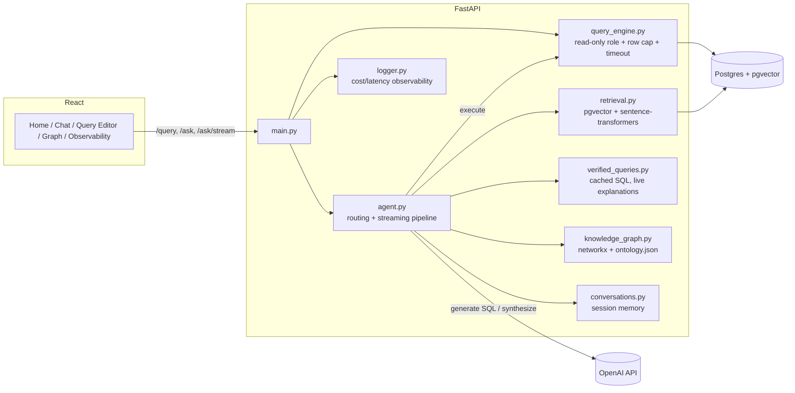

# Traceview

A GTM data assistant that answers plain-English questions with real SQL, retrieved account context, or both fused into one answer - not just a chatbot wrapper around a database. Read-only enforced at the database privilege level, evaluated by an independent LLM judge, and fully synthetic data (a fictional SaaS business, not modeled on or affiliated with any real company).


## What it does

Each question gets routed to one of four modes:

- **`sql`** - schema answers it directly (*"which accounts are at_risk?"*). Generates SQL, executes it, retries on error, streams a short explanation of the result.
- **`unstructured`** - only account notes or playbooks can answer it (*"how do I handle a pricing objection?"*). Retrieves the relevant chunks, synthesizes a cited reply.
- **`hybrid`** - needs a number *and* the story behind it (*"why is this account's consumption declining?"*). Runs the SQL, retrieves the notes, fuses them into one answer.
- **`chat`** - everything else, including an honest "I can't answer that" instead of a guessed number.

Every step is timed and shown in a reasoning trace under each answer. Home also surfaces a proactive panel on load - accounts trending under target before they're formally flagged at-risk - instead of waiting to be asked. There's also a raw SQL editor with the same safety guarantees, a knowledge graph viewer, and an observability dashboard with full cost/latency/trace detail per call.

## Architecture



Pipeline per `/ask` call: verified-match check → retrieve business context (RAG) → graph lookup (join paths) → generate SQL or a reply, streaming the writing step → execute, retrying on failure (up to 3x) → respond.

## Tech stack

| Layer | Choice | Why |
|---|---|---|
| Backend | FastAPI + Pydantic | Async, typed contracts, auto-generated docs |
| Data | Postgres + pgvector | Structured data and vector search under one privilege model |
| Migrations | Alembic | Schema changes are incremental and versioned, not a drop-and-recreate on every reseed |
| Vector search | pgvector + `all-MiniLM-L6-v2` | Local embeddings, no API cost; cosine search is a normal SQL `ORDER BY` |
| Knowledge graph | networkx | In-memory, derived from real foreign keys |
| LLM | OpenAI (`gpt-4o` generation, `gpt-4o-mini` judge) | Cheaper model for a narrower verification task |
| Streaming | Server-Sent Events | Only the free-text writing step streams - structured routing output can't stream meaningfully |
| Frontend | React + Vite + CodeMirror | Real SQL syntax highlighting, fast dev loop |
| Tests | pytest (35 tests) | The actual security and isolation boundaries, not incidental coverage |
| CI | GitHub Actions | pytest + frontend build on every push; eval suite on manual trigger |

## Running it locally

**Backend:**
```bash
cd backend
python3 -m venv venv && source venv/bin/activate
pip install -r requirements.txt
cp .env.example .env   # add your OPENAI_API_KEY and DATABASE_URL
alembic upgrade head   # creates the schema (safe to re-run any time)
python -m scripts.seed_db
python -m scripts.seed_unstructured
python -m scripts.embed_content
python -m scripts.seed_glossary
python -m scripts.seed_verified_queries
uvicorn app.main:app --reload
```

**Frontend:**
```bash
cd frontend
npm install
npm run dev
```

**Tests:**
```bash
cd backend
pip install -r requirements-dev.txt
pytest -v
```

**Eval suite** (costs a small amount of real OpenAI API usage):
```bash
cd backend
python -m scripts.run_eval
```

**Docker:**
```bash
docker compose up --build
```

## Project history

Built incrementally with Claude Code as a pairing partner.
