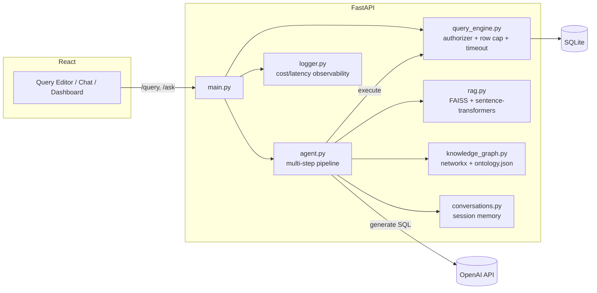

# DataLens

A natural-language SQL analyst for a business database — but the interesting part isn't the chatbot, it's everything around it: a read-only query engine enforced at the SQLite grammar level (not a string check), a knowledge graph that gives the agent explicit join paths instead of making it guess, an eval suite scored by an independent LLM judge, and full cost/latency observability on every call.


## What it does

Ask a question in plain English — *"which employees logged the most activities on deals for the Analytics Suite product?"* — and it retrieves the relevant business context, figures out the join path across four tables, generates SQL, executes it, and if the SQL fails, feeds the error back to the model and retries. Ask a follow-up in the same conversation and it resolves references to what you just asked. Ask something the data can't answer (*"what's our churn rate?"*) and it says so honestly instead of inventing a query.

There's also a plain SQL editor with the same safety guarantees, and a dashboard showing cost/latency/success-rate for every AI call.

## The parts worth reading the code for

**The safety guard is not a `.startswith("select")` check.** Early on it was — and it silently failed on two things: legitimate `WITH ... SELECT` CTEs (rejected for not starting with "select"), and disguised writes like `WITH x AS (SELECT 1) DELETE FROM deals` (which also doesn't start with "select", so a prefix check can't catch it either). It's now built on SQLite's `set_authorizer` hook, which inspects every action during query *compilation* and allow-lists only reads. Verified with a live attack against real data — the disguised-delete query above was run against the actual `deals` table and confirmed the data was untouched afterward. See `backend/query_engine.py` and `backend/tests/` (25 tests: the security boundary, auth, rate limiter, and verified-query threshold behavior).

**A knowledge graph gives the agent join paths instead of making it guess.** Multi-table joins are where text-to-SQL agents most often fail — a flat schema listing doesn't say *how* two tables connect when there's more than one hop between them. `backend/knowledge_graph.py` builds an in-memory graph (networkx) from the schema's actual foreign keys, so it can't drift from reality, enriched with `ontology.json` (entity aliases, human-readable relationship labels). Given a question, it computes the real join path via graph traversal and hands it to the model as an explicit hint. Tested live on a genuine 4-table join (`employees → activities → deals → products`) — correct SQL, first attempt.

**The eval has an LLM-as-judge, and I found a real bug in it while building it.** Pattern-matching SQL keywords and row counts catches obviously wrong queries but not queries that look plausible and answer the wrong question. `backend/judge.py` adds a second, independent model call that verifies semantic correctness. First version of the judge scored answers without the same business-glossary/conversation context the *generating* model had — and flagged a **correct** answer as wrong ("active deals" filtered to `prospecting`/`negotiation`, which is exactly this project's own definition, but the judge didn't know that definition existed). Fixed by giving the judge the same grounding context the agent used. This is a real, general lesson: a judge with less context than the generator produces false negatives on context-dependent correct answers.

**A real before/after number, not a vibe.** Running the eval surfaced that the agent had no way to say "I can't answer this" — every out-of-scope question (forecasts, satisfaction scores, churn) got a confidently hallucinated query. Added a `can_answer`-style branch (now generalized into a `chat` vs `sql` response mode) so the model can decline honestly instead of guessing. **Eval accuracy: 86.4% → 100% (22/22 single-turn + 3/3 multi-turn conversation scenarios)** after that fix — `backend/eval_set.json`, `backend/eval_conversations.json`, `backend/run_eval.py`.

**The AI never gets a shortcut around safety.** `/query` (the manual editor) and `/ask` (the agent) both call the exact same `query_engine.run_select()` — the model-generated SQL goes through the identical authorizer, row cap (500, with a `truncated` flag), and 5-second wall-clock timeout as anything a human types.

**A verified-query repository skips generation for questions that have already been proven correct.** `backend/verified_queries.py` matches incoming questions against a small set seeded directly from eval entries that passed *both* the deterministic checks and the LLM judge — "verified" means "passed the eval suite," not "eyeballed once." A close match skips the LLM call entirely: $0 cost, milliseconds instead of seconds, still through the same safety guard. The similarity threshold (0.92) was set from a measured calibration, not a guess — a genuine paraphrase of the same question scores 0.92–1.0, but a *related, differently-scoped* question ("win rate" vs. "win rate **by department**") still scores 0.80, so the threshold needed real margin above that gap or it would silently serve the wrong cached answer. `backend/tests/test_verified_queries.py` locks in both directions.

## Architecture



Every `/ask` call is a pipeline, logged step-by-step (visible in the UI's reasoning trace, not hidden in a log file): **retrieve** business context (RAG) → **graph lookup** (join paths) → **generate** SQL or a conversational reply → **execute**, retrying with the error fed back to the model on failure (up to 3 attempts) → **respond**.

## Tech stack

| Layer | Choice | Why |
|---|---|---|
| Backend | FastAPI + Pydantic | Async, typed request/response contracts, auto-generated docs |
| Data | SQLite | Right-sized for the current schema; see [Limitations](#limitations--what-id-do-with-more-time) for the Postgres tradeoff |
| Vector search | FAISS + `all-MiniLM-L6-v2` | Local, free, no API cost for retrieval |
| Knowledge graph | networkx | In-memory, derived from real foreign keys — no separate graph database needed at this schema size |
| LLM | OpenAI (`gpt-4o` generation, `gpt-4o-mini` judge) | Cheaper model for a narrower verification task, not everything on the expensive tier |
| Frontend | React + Vite + CodeMirror | Real SQL syntax highlighting, fast dev loop |
| Tests | pytest (25 tests) | Focused on the actual security boundary, not incidental coverage |
| CI | GitHub Actions | pytest + frontend build on every push; eval suite on manual trigger (costs real API money) |

## Running it locally

**Backend:**
```bash
cd backend
python3 -m venv venv && source venv/bin/activate
pip install -r requirements.txt
cp .env.example .env   # add your OPENAI_API_KEY and DATABASE_URL
python -m scripts.seed_db
python -m scripts.seed_unstructured
python -m scripts.embed_content
python -m scripts.seed_glossary
python -m scripts.seed_verified_queries
uvicorn app.main:app --reload
```

**Frontend:**
```bash
cd frontend
npm install
npm run dev
```

**Tests:**
```bash
cd backend
pip install -r requirements-dev.txt
pytest -v
```

**Eval suite** (costs a small amount of real OpenAI API usage):
```bash
cd backend
python -m scripts.run_eval
```

**Docker** (written correct-by-inspection; verify with `docker compose up` before relying on it):
```bash
docker compose up --build
```

## Limitations & what I'd do with more time

- **Conversation memory and rate limiting are in-memory, per-process** (`conversations.py`, `rate_limit.py`) — correct for a single-instance demo, would move to Redis for a multi-instance deployment. Documented in the module docstrings rather than hidden.
- **SQLite, not Postgres.** Right-sized for a 6-table schema; a real multi-tenant product would want Postgres for concurrent writes and a real user/role permission system instead of the authorizer hook (SQLite has no user model, so the authorizer is the correct SQLite-native answer — Postgres's native equivalent would be a read-only DB role).
- **No request tracing across the pipeline steps** — the trace exists per-request but isn't correlated across logs with a request ID yet.
- **No schema migrations** — `seed_db.py` drops and recreates on every run, fine for a demo, not for a system with real data to preserve.

## Project history

This was built incrementally with Claude Code as a pairing partner, week-by-week — see `PROJECT_PLAN.md` for the original plan and how it evolved (a widened schema, the knowledge graph, the chat/sql redesign, and the production-hardening pass were all real engineering decisions made mid-build, not planned from day one).
