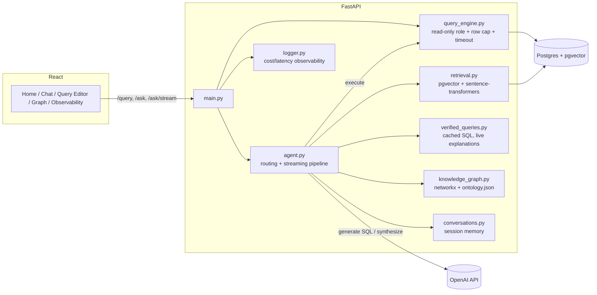

# DataLens

A GTM data assistant — but the interesting part isn't the chatbot, it's everything around it: a read-only query engine enforced at the database privilege level (not a string check), retrieval-augmented answers that fuse real SQL results with retrieved account context, a knowledge graph that gives the agent explicit join paths instead of making it guess, an eval suite scored by an independent LLM judge, and full cost/latency observability on every call. The data is entirely synthetic — a fictional, generic consumption-based SaaS business, not modeled on or affiliated with any real company.


## What it does

Ask a question in plain English and the agent picks one of four response modes per turn, not just "generate SQL or fail":

- **`sql`** — a question the schema answers directly (*"which accounts have capacity contracts marked at_risk?"*). Retrieves business-glossary context, computes the real join path, generates SQL, executes it, retries with the error fed back to the model on failure — and now streams a short, plain-language note explaining what the result shows, generated fresh from the actual rows every time.
- **`unstructured`** — a question only account notes or enablement content can answer (*"how should I handle a pricing objection?"*), answered by retrieving the relevant chunks and synthesizing a grounded, cited reply. No SQL involved.
- **`hybrid`** — needs both: a real number *and* the story behind it (*"why is this account's consumption declining?"*). Runs the SQL, retrieves the account's notes, and fuses them into one answer — explicitly flagging it if the two sources disagree instead of silently picking one.
- **`chat`** — everything else: follow-ups, meta-questions about a previous answer, genuine questions about how DataLens itself works, or an honest decline when nothing in the schema or the notes can answer it. Ask it something out of scope (*"what's our customer satisfaction score?"*) and it says so instead of inventing a number.

Every step is timed and shown in a reasoning trace under each answer — not hidden in a log file — and Home surfaces a proactive "Needs Attention" panel on load: accounts trending under their committed consumption target, including ones not yet formally flagged at-risk, each backed by the same retrieval the chat uses.

There's also a plain SQL editor with the same safety guarantees, a knowledge graph viewer, a data catalog, and an observability dashboard showing cost/latency/success-rate for every call, with full per-step trace detail.

## The parts worth reading the code for

**The safety guard is not an app-level check.** Early on it was a `.startswith("select")` check, which silently failed on legitimate `WITH ... SELECT` CTEs and on disguised writes like `WITH x AS (SELECT 1) DELETE FROM deals` — neither starts with "select," so a prefix check can't catch either case. It now runs through a dedicated `datalens_readonly` Postgres role with `GRANT SELECT` only, enforced by Postgres's own privilege system, not application code. Verified with a live attack: the disguised-delete query above was run against the real `deals` table through that role and confirmed the data was untouched afterward. See `backend/app/query_engine.py` and `backend/tests/` (35 tests: the security boundary, RAG isolation, upload isolation, auth, rate limiter, verified-query threshold behavior).

**A knowledge graph gives the agent join paths instead of making it guess — and a subtle bug in it once let raw SQL bypass retrieval entirely.** `backend/app/knowledge_graph.py` builds an in-memory graph (networkx) from the schema's actual foreign keys, enriched with `ontology.json` (entity aliases, human-readable relationship labels), and hands the model the real join path via graph traversal — e.g. *"which employees performed activities on deals sourced by a specific partner?"* resolves the real `partners → deals → activities` path, not a guess. The bug: `networkx.add_edge()` silently creates a node for any table it hasn't seen yet, and both `account_notes` and `document_chunks` have a foreign key to `accounts` — so unconditionally adding every FK edge from the live database swept them into the graph as ordinary "dimension" tables, meaning the SQL-generation prompt saw their real columns and the agent wrote raw SQL dumping note content straight into a result, completely bypassing retrieval and isolation. Fixed by restricting graph nodes to entities explicitly declared in `ontology.json`. Caught from a real pasted conversation during testing, not a planned test case.

**Structured and unstructured answers are fused, not two separate tools bolted together.** `backend/app/agent.py`'s `hybrid` mode runs the SQL, retrieves the account's notes via pgvector, and asks the model to write one answer grounded in both — explicitly told to flag disagreement between the two sources rather than silently pick one. Retrieval is isolation-safe by construction, not by a filter applied after the fact: account-scoped chunks always carry a real, FK-validated `account_id`; global content never does; and the query filters in SQL (`account_id = %s OR account_id IS NULL`), so there's no code path where one account's private note could leak into another account's answer.

**The eval has an LLM-as-judge, and I found a real bug in it while building it.** Pattern-matching SQL keywords and row counts catches obviously wrong queries but not queries that look plausible and answer the wrong question. `backend/app/judge.py` adds a second, independent model call that verifies semantic correctness against this project's own glossary definitions — e.g. "active deal" means `stage` is `discovery`, `technical_validation`, `business_case`, or `negotiation`, not a date-based check, and not the judge's own guess at what "active" should mean. First version of the judge scored answers without that same glossary context the *generating* model had, and flagged a **correct** answer as wrong because it didn't know the project's own definition existed. Fixed by giving the judge the same grounding context the agent used — a judge with less context than the generator produces false negatives on context-dependent correct answers, a general lesson, not a one-off fix.

**A verified-query cache skips the expensive step, but never caches a canned explanation.** `backend/app/verified_queries.py` matches incoming questions against a small set of pre-vetted question/SQL pairs — "verified" means "passed the eval suite," not "eyeballed once" — and skips the classification + SQL-generation call entirely on a close match: $0 cost, milliseconds instead of seconds. The explanation attached to the result is *not* cached, though, even for a verified match — matching is similarity-based (≥0.92), not exact text, so a cached explanation written for the stored question could easily not answer what was actually asked this time. The explanation is generated live from the real question and the real returned rows, every time; only the SQL itself is safe to reuse verbatim.

**The agent has an explicit floor for its own uncertainty, and it wasn't always there.** Asked *"how does the RAG component of this work?"*, an earlier version confidently explained a red/amber/green status indicator — a real concept elsewhere, but not anything this app has — instead of retrieval-augmented generation, this app's own retrieval pipeline. A fluent wrong answer instead of an honest "which do you mean." Fixed by giving the system prompt a short, true description of DataLens's own architecture to answer from, plus an explicit rule against picking one plausible interpretation of an ambiguous term and answering as if it were the only one.

**Generated SQL uses fuzzy name matching, not exact — and returning `NULL` instead of erroring is the more dangerous failure.** A generated query filtering `WHERE accounts.name = 'Highfield Care'` against a stored name of `'Highfield Care Partners'` doesn't error — it returns one row containing `NULL`, which reads as a real (if boring) answer, not a failed lookup. Fixed with a system-prompt rule to use `ILIKE '%...%'` for any name-like text filter — which loses no precision when the exact name is given, since a wildcard match is a superset of an exact one, not a looser replacement for it.

**Everything the model writes streams token-by-token, but not uniformly** — because not everything *can*. The routing decision (`sql` / `chat` / `unstructured` / `hybrid`) is strict structured JSON output; streaming that would just show fragments of raw JSON assembling, which is worse than a spinner, not better. The part that's genuinely streamable is the plain-text writing step afterward — a `sql` answer's explanation, or a `hybrid`/`unstructured` answer's synthesized reply — served over Server-Sent Events, with the frontend auto-following new content unless you've scrolled up to reread something.

## Architecture



Every `/ask` call is a pipeline, logged step-by-step (visible in the UI's reasoning trace, not hidden in a log file): **verified-match check** → **retrieve** business context (RAG) → **graph lookup** (join paths) → **generate** SQL or a conversational reply, streaming the writing step → **execute**, retrying with the error fed back to the model on failure (up to 3 attempts) → **respond**.

## Tech stack

| Layer | Choice | Why |
|---|---|---|
| Backend | FastAPI + Pydantic | Async, typed request/response contracts, auto-generated docs |
| Data | Postgres + pgvector | Structured data and vector search live together, queried with one privilege model, not two separate systems |
| Vector search | pgvector + `all-MiniLM-L6-v2` | Local embeddings, no API cost for retrieval; cosine search runs as a normal SQL `ORDER BY`, not a bolted-on index |
| Knowledge graph | networkx | In-memory, derived from real foreign keys — no separate graph database needed at this schema size |
| LLM | OpenAI (`gpt-4o` generation, `gpt-4o-mini` judge) | Cheaper model for a narrower verification task, not everything on the expensive tier |
| Streaming | Server-Sent Events | The writing step (explanations, hybrid/unstructured answers) streams token-by-token; strict structured output (routing) doesn't, since partial JSON isn't meaningfully readable |
| Frontend | React + Vite + CodeMirror | Real SQL syntax highlighting, fast dev loop |
| Tests | pytest (35 tests) | Focused on the actual security and isolation boundaries, not incidental coverage |
| CI | GitHub Actions | pytest + frontend build on every push; eval suite on manual trigger (costs real API money) |

## Running it locally

**Backend:**
```bash
cd backend
python3 -m venv venv && source venv/bin/activate
pip install -r requirements.txt
cp .env.example .env   # add your OPENAI_API_KEY and DATABASE_URL
python -m scripts.seed_db
python -m scripts.seed_unstructured
python -m scripts.embed_content
python -m scripts.seed_glossary
python -m scripts.seed_verified_queries
uvicorn app.main:app --reload
```

**Frontend:**
```bash
cd frontend
npm install
npm run dev
```

**Tests:**
```bash
cd backend
pip install -r requirements-dev.txt
pytest -v
```

**Eval suite** (costs a small amount of real OpenAI API usage):
```bash
cd backend
python -m scripts.run_eval
```

**Docker:**
```bash
docker compose up --build
```

## Limitations & what I'd do with more time

- **Conversation memory and rate limiting are in-memory, per-process** (`conversations.py`, `rate_limit.py`) — correct for a single-instance deployment, would move to Redis for a multi-instance one. Documented in the module docstrings rather than hidden.
- **Hybrid synthesis is single-account.** A question spanning several accounts at once ("compare consumption trends across our top 3 at-risk accounts") isn't supported by the current single-`account_hint` architecture — a real, known gap, not something the routing silently gets wrong.
- **No request tracing across the pipeline steps** — the trace exists per-request but isn't correlated across logs with a request ID yet.
- **No schema migrations** — the seed scripts truncate and recreate on every run, fine for a demo, not for a system with real data to preserve.

## Project history

This was built incrementally with Claude Code as a pairing partner, week-by-week — see `PROJECT_PLAN.md` for the original plan and how it evolved (a widened schema, the knowledge graph, RAG and hybrid answers, streaming, and the production-hardening pass were all real engineering decisions made mid-build, not planned from day one).
